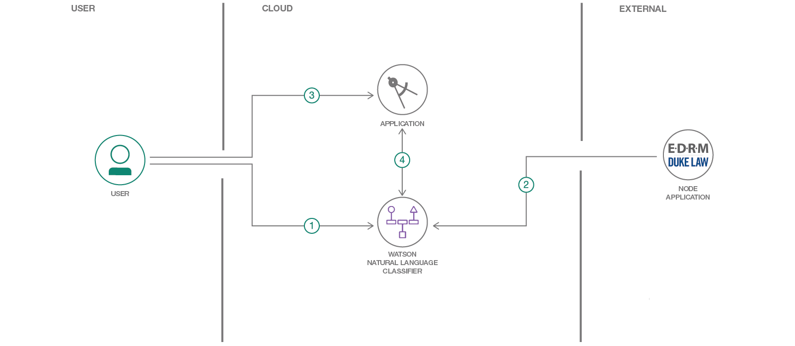

# Determine email spam with Watson Natural Language Classifier

In this Code Pattern, we will build an app that classifies email, either labeling it as "Phishing", "Spam", or "Ham" if it does not appear suspicious. We'll be using IBM Watson Natural Language Classifier (NLC) to train a model using email examples from an [EDRM Enron email dataset](http://nlp.cs.aueb.gr/software.html). Please note that this data is [free to use for non-commercial use, and explicit permission must be obtained otherwise](https://labs-repos.iit.demokritos.gr/skel/i-config/downloads/PU123ACorpora_readme.txt). The custom NLC model can be quickly and easily built in the Web UI, deployed into our nodejs app using the [Watson Developer Cloud Nodejs SDK](https://github.com/watson-developer-cloud/node-sdk), and then run from a browser.

When the reader has completed this Code Pattern, they will understand how to:

* Build a [Watson Natural Language Classifier](https://www.ibm.com/watson/services/natural-language-classifier/) model using the Web UI
* Create a nodejs app that utilizes the NLC model to classify emails as Phishing or not.
* Use the Watson Developer Cloud SDK for nodejs.

## Flow



1. User interacts with Natural Language Classifier (NLC) GUI to train the model.
2. [EDRM](https://www.edrm.net/resources/data-sets/edrm-enron-email-data-set/) data is loaded to the NLC service to provide sample emails for training.
3. User sends email text to the application to have it classified.
4. App uses Watson Natural Language Classifier to determine if text is phishing, spam, or ham.

## Included components

* [Watson Studio](https://www.ibm.com/cloud/watson-studio): Analyze data using RStudio, Jupyter, and Python in a configured, collaborative environment that includes IBM value-adds, such as managed Spark.
* [Watson Natural Language Classifier](https://www.ibm.com/watson/services/natural-language-classifier/): An IBM Cloud service to interpret and classify natural language with confidence.
* [Node.js](https://nodejs.org/): An open-source JavaScript run-time environment for executing server-side JavaScript code.

## Watch the Video

[](https://youtu.be/vnnUYAi9Zy4)

## Steps

1. [Clone the repo](#1-clone-the-repo)
1. [Create IBM Cloud services](#2-create-ibm-cloud-services)
1. [Create a Watson Studio project](#3-create-a-watson-studio-project)
1. [Train the NLC model](#4-train-the-nlc-model)
1. [Run the application](#5-run-the-application)

### 1. Clone the repo

Clone the `nlc-email-phishing` repo locally. In a terminal, run:

```bash
git clone https://github.com/IBM/nlc-email-phishing
```

### 2. Create IBM Cloud services

Create the following service:

* [Natural Language Classifier](https://cloud.ibm.com/catalog/services/natural-language-classifier)

### 3. Create a Watson Studio project

* Log into IBM's [Watson Studio](https://dataplatform.cloud.ibm.com). Once in, you'll land on the dashboard.

* Create a new project by clicking `+ New project` and choosing `Data Science`:

  

* Enter a name for the project name and click `Create`.

* **NOTE**: By creating a project in Watson Studio a free tier `Object Storage` service and `Watson Machine Learning` service will be created in your IBM Cloud account. Select the `Free` storage type to avoid fees.

  

* Upon a successful project creation, you are taken to a dashboard view of your project. Take note of the `Assets` and `Settings` tabs, we'll be using them to associate our project with any external assets (datasets and notebooks) and any IBM cloud services.

  

### 4. Train the NLC model

The data used in this example is from an [EDRM Enron email dataset](http://nlp.cs.aueb.gr/software.html) and a cleaned version we'll use is available in the repo under [data/Email-trainingdata-20k.csv](data/Email-trainingdata-20k.csv). We'll now train an NLC model using this data.

* From the new project `Overview` panel, click `+ Add to project` on the top right and choose the `Natural Language Classifier` asset type.

  

* A new instance of the NLC tool will launch.

  

* Add the data to your project by clicking the `Browse` button in the right-hand `Upload to project` section and browsing to the cloned repo. Choose both [`data/Email-trainingdata-20k.csv`](`data/Email-trainingdata-20k.csv`) and [`Email-testingdata.json`](`Email-testingdata.json`).

* Drag and drop the `Email-trainingdata-20k.csv` file you uploaded to the `Create a Class` box:

  

* Click the `Train model` button to begin training. The model will take around an hour to train.

* To check the status of the model, and access it after it trains, go to your project in the `Assets` tab of the `Models` section. The model will show up when it is ready. Double click to see the `Overview` tab.

  

* The first line of the `Overview` tab contains the `Model ID`, remember this value as we'll need it in the next step.

* Click the `Test` tab and enter a phrase from an email to test the classifier. For example, *"Can you please send your password?"* is classified with **0.81** confidence as Phishing.

* Click the `Implementation` tab to see how to use the classifier with Curl, Java, Node, or Python.

### 5. Run the application

Follow the steps below for deploying the application:

* [Run on IBM Cloud](#run-on-ibm-cloud)

  **OR**

* [Run locally](#run-locally)

#### Run on IBM Cloud

* Press the `Deploy to IBM Cloud` button below.

<p align="center">
    <a href="https://cloud.ibm.com/devops/setup/deploy?repository=https://github.com/IBM/nlc-email-phishing.git">
    
    </a>
</p>

* From the IBM Cloud deployment page click the `Deploy` button.

* From the *Toolchains* menu, click the *Delivery Pipeline* to watch while the app is deployed. Once deployed, the app can be viewed by clicking *View app*.

* The app and service can be viewed in the [IBM Cloud dashboard](https://cloud.ibm.com/resources). The app will be named `nlc-email-phishing`, with a unique suffix.

* We now need to add a few environment variables to the application's runtime so the right classifier service and model are used. Click on the application from the dashboard to view its settings.

* Once viewing the application, click the `Runtime` option on the menu and navigate to the `Environment Variables` section.

* Update the `CLASSIFIER_ID`, `NATURAL_LANGUAGE_CLASSIFIER_USERNAME`, and `NATURAL_LANGUAGE_CLASSIFIER_PASSWORD` variables with your `Model ID` from [Step 4](#4-train-the-nlc-model)  and NLC service credentials from [Step 2](#2-create-ibm-cloud-services). Click `Save`.

  

1. After saving the environment variables, the app will restart. After the app restarts you can access it by clicking the *Visit App URL* button.

#### Run locally

* In the root of the project create a file named `.env`. A [sample](server/env.example) is provided and a snippet is shown below.

  ```bash
  # Replace the credentials here with your own.
  NATURAL_LANGUAGE_CLASSIFIER_USERNAME=<add_NLC_username>
  NATURAL_LANGUAGE_CLASSIFIER_PASSWORD=<add_NLC_password>
  CLASSIFIER_ID=<add_ModelID>
  ```

* Update the `CLASSIFIER_ID`, `NATURAL_LANGUAGE_CLASSIFIER_USERNAME`, and `NATURAL_LANGUAGE_CLASSIFIER_PASSWORD` variables with your `Model ID` from [Step 4](#4-train-the-nlc-model)  and NLC service credentials from [Step 2](#2-create-ibm-cloud-services).

* Ensure [Node.js](https://nodejs.org/en/) is installed.

* Install the app dependencies by running:

  ```bash
  npm install
  ```

* Start the app by running:

  ```bash
  npm start
  ```

* Open a browser and point to [`localhost:3000`](http://localhost:3000).

## Sample output


## Links

* [Live web demo](https://nlc-email-spam.mybluemix.net/)
* [Demo on Youtube](https://youtu.be/vnnUYAi9Zy4)
* [Watson Node.js SDK](https://github.com/watson-developer-cloud/node-sdk)

## Learn more

* **Artificial Intelligence Code Patterns**: Enjoyed this Code Pattern? Check out our other [AI Code Patterns](https://developer.ibm.com/technologies/artificial-intelligence/).
* **Data Analytics Code Patterns**: Enjoyed this Code Pattern? Check out our other [Data Analytics Code Patterns](https://developer.ibm.com/technologies/data-science/)
* **AI and Data Code Pattern Playlist**: Bookmark our [playlist](https://www.youtube.com/playlist?list=PLzUbsvIyrNfknNewObx5N7uGZ5FKH0Fde) with all of our Code Pattern videos

## License

This code pattern is licensed under the Apache Software License, Version 2.  Separate third party code objects invoked within this code pattern are licensed by their respective providers pursuant to their own separate licenses. Contributions are subject to the [Developer Certificate of Origin, Version 1.1 (DCO)](https://developercertificate.org/) and the [Apache Software License, Version 2](https://www.apache.org/licenses/LICENSE-2.0.txt).

[Apache Software License (ASL) FAQ](https://www.apache.org/foundation/license-faq.html#WhatDoesItMEAN)
